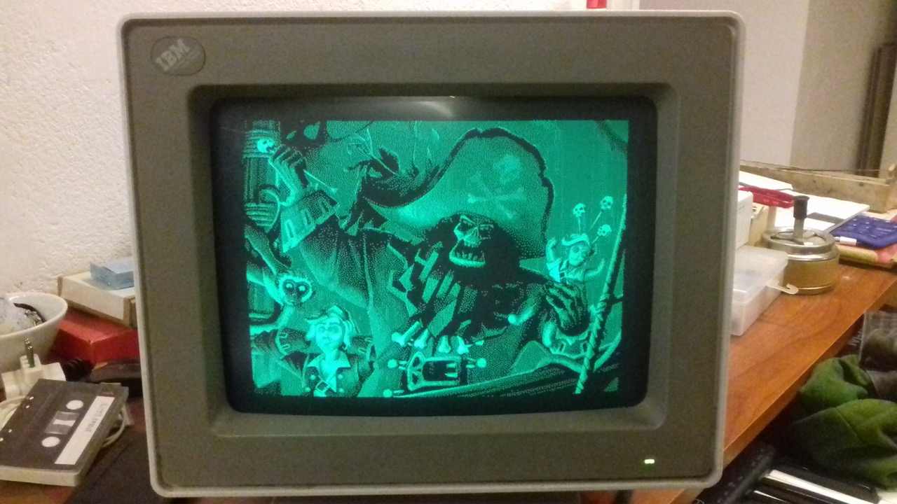
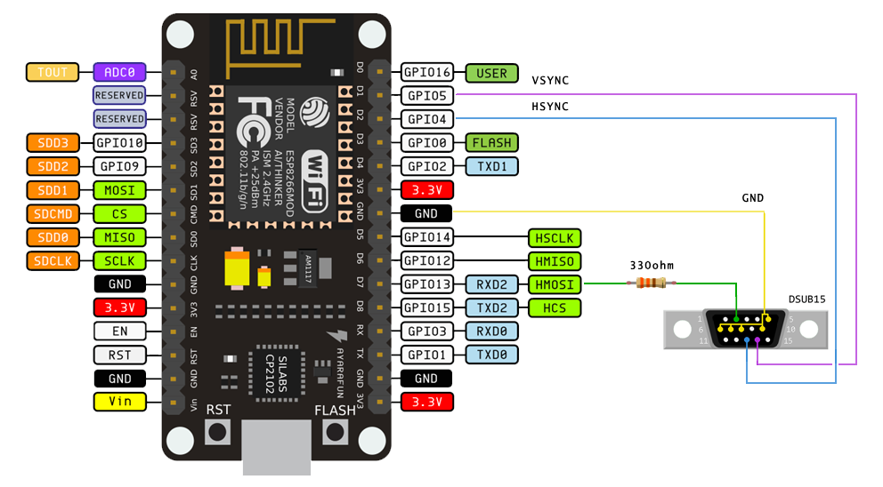
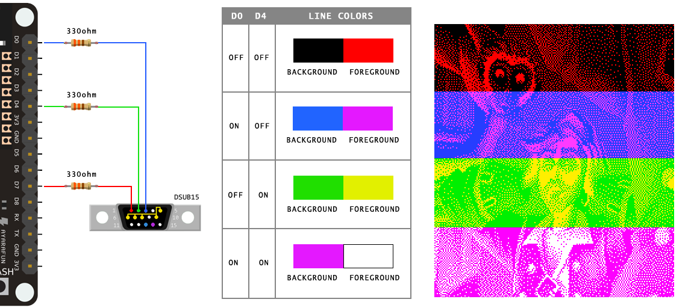
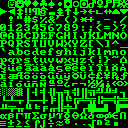

# ESPVGAX Library for ESP8266

COPYRIGHT (C) 2018 Sandro Maffiodo  
[smaffer@gmail.com](mailto:smaffer@gmail.com)  
[http://www.sandromaffiodo.com](http://www.sandromaffiodo.com)

YouTube videos:

Some photos:

 

## What is ESPVGAX?

This is a VGA library for ESP8266.  
To use this library you need only 1 resistor and one DSUB15 connector.  
This library require an ESP8266 with all GPIO exposed, like ESP-12E, NodeMCU-12E board or any board that expose GPIO5 (D1), GPIO4 (D2) and GPIO13 (D7)

## Credits

VGA signal generation based on [https://github.com/hchunhui/esp-vga](https://github.com/hchunhui/esp-vga) (thanks for your awesome works).

## Video

The library implement a 512x480px framebuffer with 1bpp, where each pixel is stored as a single bit. 
The framebuffer is stored inside RAM and require 30720 bytes. The VGA signal generation is stable only if you do not use any other hardware feature of the MCU (like Wifi or Serial). If you want, in theory, you can use another board to drive the one that use ESPVGAX library, by writing a comunication layer based on SoftwareSerial or I2C.

The library support an extendend coloring system that allow you to enable two additionals colors for each line of pixels. For example you can wire the primary color to GREEN (framebuffer 1bit color will be green or black) and enable RED and BLUE dynamically, for each line of pixels. This mode is called "line coloring"

In addition, you can change the background color from BLACK to another color by wiring the D5 PIN. This mode is called "background coloring".

## Wiring

For the basic usage you need:

- 1x 330ohm resistor 
- 1x DSUB15 female connector

Then connect them like the following schema.  

*NOTE: The DSUB15 connector is shown from rear view*

### Colors combination and Additional colors
The 2 colors generated from ESPVGAX library are not predefined. You can connect the D7 PIN with one of the VGA DSUB15 RGB PINS, selecting the color combination that you prefer. 

These are all of the possible combinations, done without additional components:

If you want to use the "background coloring" mode, you can wire the D5 PIN to one of the others VGA DSUB15 RGB PINS, for example, if you wire the D5 PIN to the VGA BLUE PIN, you can obtain these colors combinations:

The same things can be done by wiring D5 PIN to GREEN or RED, and wiring the remaining VGA PINS in some other combinations.

If you want you can use the "line coloring" mode, by enabling the ESPVGAX_EXTRA_COLORS constant (inside ESPVGAX.h) and wiring the VGA RGB PINS in some combinations. For example, if you wire the primary color (D7 PIN) to RED and wire GREEN and BLUE to the additional line colors PINS (D0 and D4) you can obtain these colors, selected line by line (setLineProp method):

Keep in mind that the line colors cannot be changed inside a single line. These additional color PINS will be enabled or disabled before generating the signal of a single line of pixels.

**WARNING** if you enable ESPVGAX_EXTRA_COLORS and wire D0 and D4 PINS you cannot flash the MCU firmware. D4 PIN need to be detached before flashing the MCU firmware or the flashing process will not work.

## 32bit and 8bit Framebuffer

The internal 512x480px framebuffer is implemented as a 32bit framebuffer, with 16 32bit words for each line of pixels. You can write to the framebuffer 32 pixels at a time (putpixel32 method), in this case the write operation will be faster than writing single pixels.
The same framebuffer can be written 8 pixels at a time, by using a different memory pointer and a dedicated set of methods (putpixel8, xorpixel8, etc ..).

## Interrupt and Timers

ESPVGAX library will use only one timer: TIMER0 or TIMER1. You can choose one of these timers by changing the ESPVGAX_TIMER constant inside ESPVGAX.h header. From my tests the TIMER1 seem to be more stable.

## 80Mhz or 160Mhz

This library support both 80Mhz and 160Mhz MCU running speed. Keep in mind that the 160Mhz version will not work with the hardware TIMER0.

## Limitations

When this library is running (begin/end methods) some Arduino functions cannot be used. For example, if you return from the loop function, Arduino firmware will call yield function. This function can generate some noises to the VGA signal. This event also happen if you call the Arduino delay function. More noises will be generated if you try to use Wifi and ESPVGAX both at the same time... To prevent noises you need to temporarely turn off ESPVGAX and restart that after Wifi comunications (see /examples/Wifi for example).
Instead of using these Arduino functions you can use the ESPVGAX versions: delay(), rand(), srand().

## Library usage

To use the ESPVGAX library you need to include its header

    #include <ESPVGAX.h>

ESPVGAX class is static, so you can use the class without create an instance of it:

    void setup() {
      ESPVGAX::begin();
    }”

Or, if you prefer, you can create your instance, but keep in mind that cannot be
more than one ESPVGAX instance at a time:

    ESPVGAX vga;

    void setup() {
      vga.begin();
    }

## Examples

This is a simple example of putpixel8 function. The putpixel8 function put 8
pixels at a time. The following code create a pattern of colors in the setup
function:

	  #include <ESPVGAX.h>

    ESPVGAX vga;

    void setup() {
      vga.begin();
      vga.clear(0xAA);
      for (int y=0; y!=ESPVGAX_HEIGHT; y++) {
        for (int x=0; x!=ESPVGAX_BWIDTH; x++) {
          vga.putpixel8(x, y, vga.rand()%2);
        }
      }
    }
    void loop() {
      while (1) {
        //never return from loop(). never call delay() or yield() functions
      }
    }

For the others examples, you can load and build one of the examples released with ESPVGAX:

- **RandomPixel** generate random pixels using putpixel, putpixel8 and putpixel32
- **Draw** draw circles, rectangles and lines
- **Image** draw an image
- **BitFont** print a string using a variable width font
- **BitmapFont** print a string using a monospaced font
- **BitmapFontPlotter** print a string one character at a time, like a plotter or a terminal
- **BitmapFontRandom** print random characters using a monospaced font
- **3D** draw some cubes in 3D, porting of a famous Adafruit example program
- **Wifi** start a webserver and wait external messages. each text message sent over Wifi will be displayed for 10 seconds
- **Demo** a DEMO sequence of some of other tests
   
## Fonts

These fonts are released with ESPVGAX, inside the /fonts/ folder:

- **Arial 12**  
- **Century Gothic 11**  
- **Courier 10**  
- **Lucida 11**   
- **Lucida 10**  
- **Millifont 6 (created by me)**  
- **Microfont 6 (created by me)**  
- **Monaco 9**  
- **Monospaced DOS 12**  
- **Monospaced DOS 8**  
- **MS Sans 10**  
- **Ocra 9**  
- **PT Monospaced 9**  
- **Tahoma 11**  
- **Times New Roman 11**  

## Tools

### 1bitimage

To convert an image to the ESPVGAX format (1bit per pixel) i wrote a simple webapp that reads an image and create a C/C++ source file to be used with ESPVGAX.

The image that you can use as a source must use only two colors, black and white images will work fine.

The source file of the webapp is inside the tools directory. You can open 1bitimage.html with your webbrowser and run it locally. I use Google Chrome, dunno if works with other webbrowsers.

### 1bitfont

With 1bitfont you can create your fonts from a single image and convert them to be used with ESPVGAX library. The tool reads an image that contains all font's glyphs are separated from one or more vertical blank lines. All glyphs are extracted and converted to a C/C++ source file.

1bitfont is a webapp, like 1bitimage, that can run locally on your webbrowser.
    
## FAQ

- How to center the video signal horizontally? If you want, you can modify the code of the library, where the HSYNC signal is generated. Seach NOP_DELAY inside ESPVGAX.cpp. Wrong values can broke the VGA signal
- How can i prevent screen flickering? At this time there is no one mechanism to prevent the flickering. From my tests, when flicker appear, there is a delay in the interrupt call or in the pixeldata output timing. Some flickers will appear if you try to read more than 32K from FLASH (for example in the /examples/Image example you can se a little flicker), the cause can be a cache miss inside the memory mapping of ESP8266??
- How can i change PINS? In theory is possible to change HSYNC and VSYNC PINS by changing the library header ESPVGAX.h. D7 and D5 PINS cannot be changed becouse are dedicated to the MCU hardware HSPI. For D0 and D4 PINS you can try to change them but if you change D0 you need to modify the interrupt code where GP16O register is used
- How can i change the screen resolution, for example to 320x240. In this version of ESPVGAX you can't. In theory the screen WIDTH can be easily reduced, to free up some RAM. Resolution HEIGHT can be reduced but the resultant signal will be not vertical centered
- What's next? I am working on a software bitbanging variant of ESPVGAX that can, in theory, display more than 1bpp. My idea is to lower the resolution to 320x240 and increase the bpp to 4 (4 bit per pixel). ESP32 is the new board, released after ESP8266.. VGA can probably be generated fine on ESP32 too, with some modifications to the code.

## Happy hacking

If you find a way to optimize the speed of the library, or find a way to remove screen flickering let me know!

Happy hacking!
